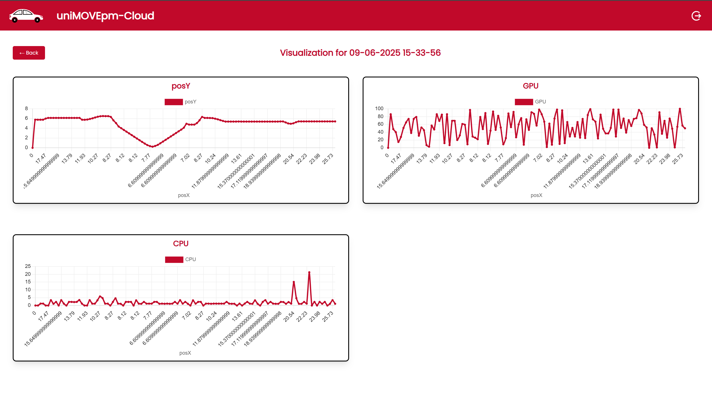
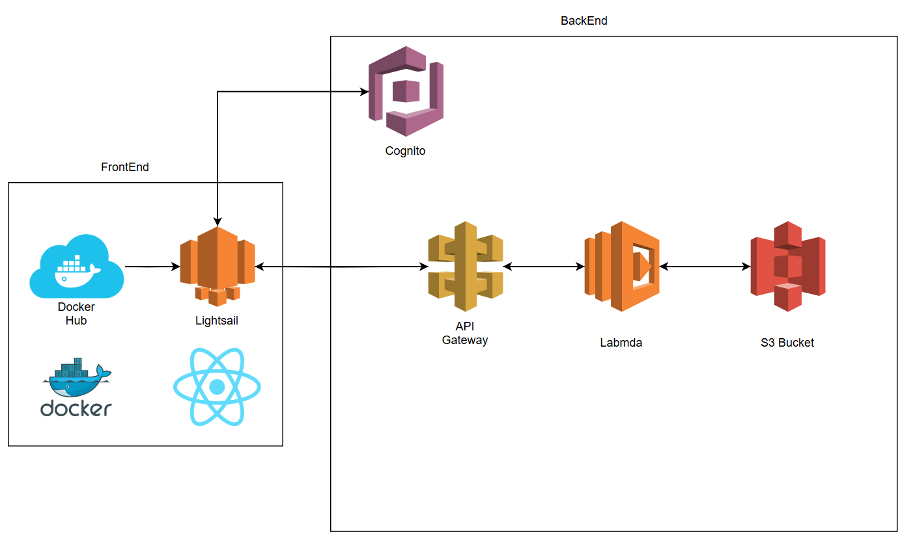

# UniMovePM Cloud




This projetc is linked to the uniMOVEpm analytics dashboard web based comprehensive analytics dashboard designed for monitoring and controlling autonomous vehicles in the Bosch Future Mobility Challenge. The idea behind the project is to buils a modern cloud hosted website for visualizing and managing simulation data coming from the numerous simulation sessions in preparation for the competition and also for deep analysis during the competition days to improve the performance of the car. The website is built with React, TypeScript, Vite, and Chart.js.  
Authentication is handled via AWS Cognito, and the app is ready for containerized deployment (Docker, AWS ECS).

---

## Features

- **Authentication:** Secure login with AWS Cognito.
- **Simulation Management:** View, filter, and delete simulation.
- **Data Visualization:** Interactive charts for simulation data using Chart.js.
- **Skeleton Loaders:** Smooth loading experience with animated skeletons for cards and charts.
- **Production Ready:** Dockerized for easy deployment (local, cloud, ECS, etc).

---

## Getting Started

### Prerequisites

- [Node.js](https://nodejs.org/) (v18+ recommended)
- [npm](https://www.npmjs.com/) or [yarn](https://yarnpkg.com/)
- [Docker](https://www.docker.com/) (for containerization)
- AWS account (for Cognito/ECS deployment)

### Local Development

1. **Install dependencies:**
   ```sh
   npm install
   # or
   yarn install
   ```

2. **Run the app:**
   ```sh
   npm run dev
   # or
   yarn dev
   ```

3. **Open your browser:**  
   Visit [http://localhost:8080](http://localhost:8080) (or the port shown in your terminal).

---

### Docker

1. **Build the image:**
   ```sh
   docker build -t trial-image .
   ```

2. **Run the container:**
   ```sh
   docker run -p 8080:3000 trial-image
   ```

3. **Or use Docker Compose:**
   ```sh
   docker compose up --build
   ```

   The app will be available at [http://localhost:8080](http://localhost:8080).

---

## Architecture

The architecture of **UniMovePM Cloud** is designed to be scalable, secure, and cloud-native, leveraging AWS managed services for authentication, storage, and compute. The system efficiently handles simulation data from autonomous vehicle sessions and provides a seamless analytics experience for users.

### Overview

At a high level, the architecture consists of:

- **Frontend**: A React + Vite web application, containerized with Docker and deployed on AWS Lightsail for hosting.
- **Authentication**: Managed by AWS Cognito, providing secure user login and token management.
- **API Gateway**: Acts as the entry point for all backend API requests, routing them securely to AWS Lambda functions.
- **Backend (Lambda)**: AWS Lambda functions process API requests, handle business logic, and interact with storage.
- **Storage**: Simulation data and results are stored in AWS S3 buckets.
- **Container Registry**: Docker images are stored in Docker Hub and deployed to Lightsail.

All components communicate securely, and the architecture supports easy scaling and updates.

### Diagram

Below is the architecture diagram for UniMovePM Cloud:



---

### Services Overview


- **Lightsail**:
  It’s a service designed to simplify the management of AWS Virtual Private Clouds (VPCs) and enables rapid deployment of Docker containers to the cloud. This made it an ideal choice for our use case, which involved hosting a simple React frontend and connecting it to a cloud-based backend architecture.

- **AWS Cognito**:  
  This service is used to manage user authentication and authorization through JWT token-based logic, ensuring privacy and security for API endpoint access.

- **API Gateway**:  
  Is used as a middleware to provide controlled access to the resources stored in the backend by exposing a public endpoint url and then protecting all the routes with the Cognito integration.

- **AWS Lambda**:  
  A serverless computing service that enables running code without the need to manage servers or runtime environments. In this case, it was used as a proxy for the API Gateway, facilitating request handling and communication with the backend database.

- **AWS S3**:  
  A highly scalable object storage service that allows you to store and retrieve any type of data from anywhere in the world.

---

## Project Structure

```
src/
  Components/         # React components (cards, charts, skeletons, etc)
  Contexts/           # React context providers (auth, settings)
  Shared/             # Shared utilities and interfaces
  App.tsx             # Main app component
  Router.tsx          # Routing logic
  Visualization.tsx   # Visualization page
  ...
public/
  ...
Dockerfile
docker-compose.yml
vite.config.ts
.gitignore
```

---

## Customization

- **Cognito:** Configured AWS Cognito settings in the authentication context/provider.
- **API:** Update related API calls in `src/Shared/ApiFunctionCaller.ts` as needed.
- **Styling:** Tailwind CSS is used for styling.

---

## License

This project is for educational and demonstration purposes.

---

## Author

Developed by Lorenzo Serloni & Simone Marconi.

