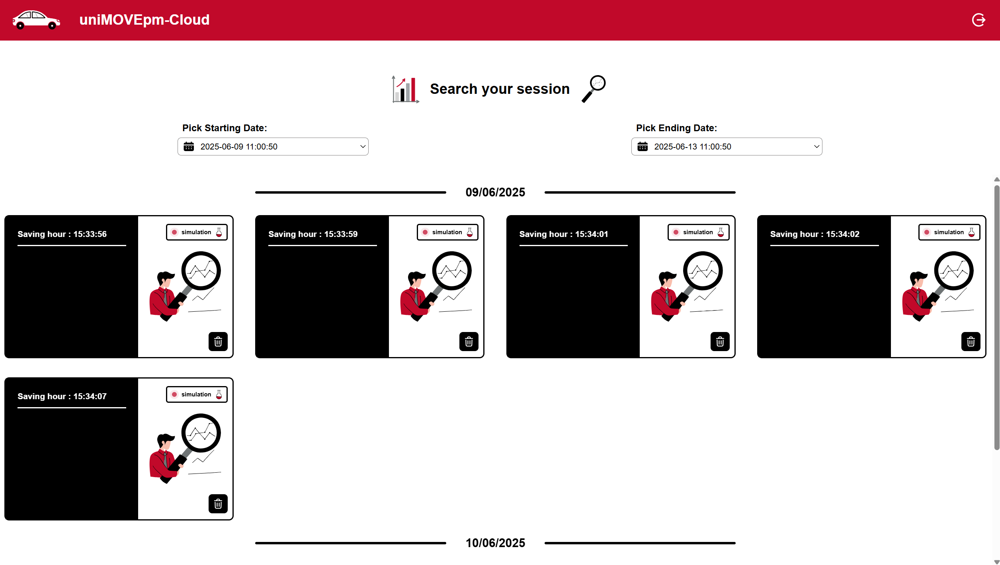

# UniMovePM Cloud





This projetc is linked to the uniMOVEpm analytics dashboard web based comprehensive analytics dashboard designed for monitoring and controlling autonomous vehicles in the Bosch Future Mobility Challenge. The idea behind the project is to buils a modern cloud hosted website for visualizing and managing simulation data coming from the numerous simulation sessions in preparation for the competition and also for deep analysis during the competition days to improve the performance of the car. The website is built with React, TypeScript, Vite, and Chart.js.  
Authentication is handled via AWS Cognito, and the app is ready for containerized deployment (Docker, AWS ECS).

---

## Features

- **Authentication:** Secure login with AWS Cognito.
- **Simulation Management:** View, filter, and delete simulation.
- **Data Visualization:** Interactive charts for simulation data using Chart.js.
- **Skeleton Loaders:** Smooth loading experience with animated skeletons for cards and charts.
- **Production Ready:** Dockerized for easy deployment (local, cloud, ECS, etc).

---

## Getting Started

### Prerequisites

- [Node.js](https://nodejs.org/) (v18+ recommended)
- [npm](https://www.npmjs.com/) or [yarn](https://yarnpkg.com/)
- [Docker](https://www.docker.com/) (for containerization)
- AWS account (for Cognito/ECS deployment)

### Local Development

1. **Install dependencies:**
   ```sh
   npm install
   # or
   yarn install
   ```

2. **Run the app:**
   ```sh
   npm run dev
   # or
   yarn dev
   ```

3. **Open your browser:**  
   Visit [http://localhost:8080](http://localhost:8080) (or the port shown in your terminal).

---

### Docker

1. **Build the image:**
   ```sh
   docker build -t trial-image .
   ```

2. **Run the container:**
   ```sh
   docker run -p 8080:3000 trial-image
   ```

3. **Or use Docker Compose:**
   ```sh
   docker compose up --build
   ```

   The app will be available at [http://localhost:8080](http://localhost:8080).

---

## Architecture

The architecture of **UniMovePM Cloud** is designed to be scalable, secure, and cloud-native, leveraging AWS managed services for authentication, storage, and compute. The system efficiently handles simulation data from autonomous vehicle sessions and provides a seamless analytics experience for users.

### Overview

At a high level, the architecture consists of:

- **Frontend**: A React + Vite web application, containerized with Docker and deployed on AWS Lightsail for hosting.
- **Authentication**: Managed by AWS Cognito, providing secure user login and token management.
- **API Gateway**: Acts as the entry point for all backend API requests, routing them securely to AWS Lambda functions.
- **Backend (Lambda)**: AWS Lambda functions process API requests, handle business logic, and interact with storage.
- **Storage**: Simulation data and results are stored in AWS S3 buckets.
- **Container Registry**: Docker images are stored in Docker Hub and deployed to Lightsail.

All components communicate securely, and the architecture supports easy scaling and updates.

### Diagram

Below is the architecture diagram for UniMovePM Cloud:


---

### Component Details

- **Frontend (React App on Lightsail)**:  
  Provides the user interface for authentication, simulation management, and data visualization. Deployed as a Docker container on AWS Lightsail, with images pulled from Docker Hub.

- **AWS Cognito**:  
  Handles user authentication and authorization, issuing tokens used by the frontend to access protected resources.

- **API Gateway**:  
  Exposes RESTful endpoints for the frontend, forwarding requests to Lambda functions.

- **AWS Lambda**:  
  Stateless compute functions that process API requests, interact with S3 for data storage/retrieval, and enforce business logic.

- **AWS S3**:  
  Stores simulation session data, results, and any static assets needed by the application.

---

This architecture ensures that UniMovePM Cloud is robust, maintainable, and ready for production.

## Project Structure

```
src/
  Components/         # React components (cards, charts, skeletons, etc)
  Contexts/           # React context providers (auth, settings)
  Shared/             # Shared utilities and interfaces
  App.tsx             # Main app component
  Router.tsx          # Routing logic
  Visualization.tsx   # Visualization page
  ...
public/
  ...
Dockerfile
docker-compose.yml
vite.config.ts
.gitignore
```

---

## Customization

- **Cognito:** Configured AWS Cognito settings in the authentication context/provider.
- **API:** Update related API calls in `src/Shared/ApiFunctionCaller.ts` as needed.
- **Styling:** Tailwind CSS is used for styling.

---

## License

This project is for educational and demonstration purposes.

---

## Author

Developed by Lorenzo Serloni & Simone Marconi.

